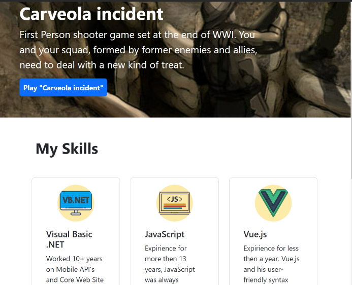

# Work-Portfolio
Website to showcase work achievements and skills, made with Bootstrap.

## Instructions

A responsive, personal web site that shows the works and skill of a developer, with navigations links that will take the user to the specific section of the page and thumbnails and links of particular work done. 

In the 'Skills' section, you can find a list of skills that the developer has.

In the 'My Work' section, you can find a list of projects that the developer has.

In the 'About Me' section, you can find downloadable resume, a photo of the developer, and a link to the developer's GitHub profile.

At the bottom of the web page, there is a link section which can be used for contacting the developer on social media.

You can find live preview in this link : [Preview](https://joekrstevskigj.github.io/Work-Portfolio-Bootstrap/)

### Screenshot 1 ###
This shows the header part of the page, along with the navigation

### Screenshot 2 ###
The content of the page - skills

### Screenshot 3 ###
The content of the page - part of my work and about me

### Tablet View ###
Tablet View of the top part of the page

### Phone View ###
Phone View of the top part of the page

